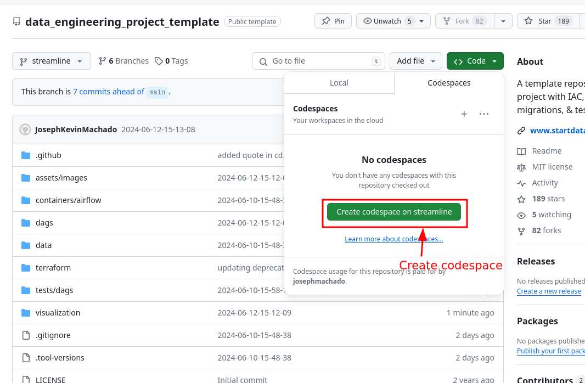
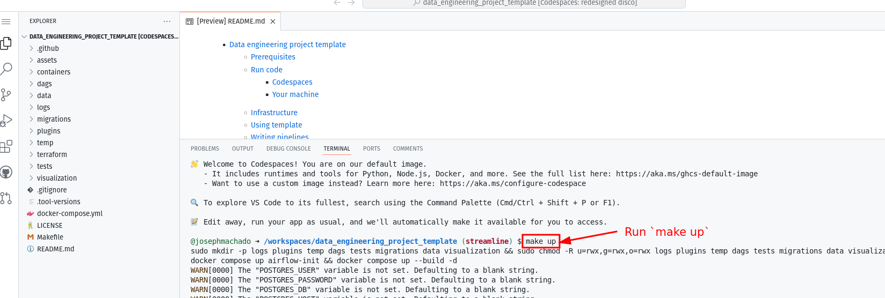
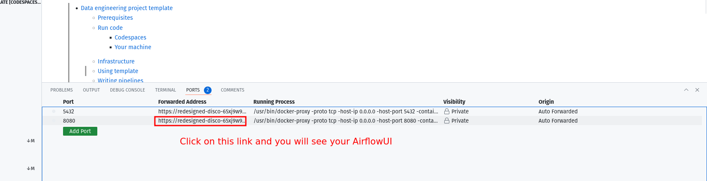
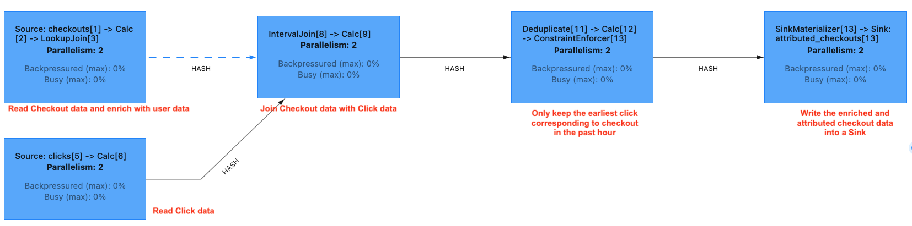

* [Beginner Data Engineering Project - Stream Version](#beginner-data-engineering-project---stream-version)
   * [Project](#project)
   * [Run on codespaces](#run-on-codespaces)
   * [Run locally](#run-locally)
      * [Prerequisites](#prerequisites)
   * [Architecture](#architecture)
   * [Code design](#code-design)
   * [Run streaming job](#run-streaming-job)
   * [Check output](#check-output)
   * [Tear down](#tear-down)
   * [Contributing](#contributing)
   * [References](#references)

# Beginner Data Engineering Project - Stream Version

Code for blog at [Data Engineering Project Stream Edition](https://www.startdataengineering.com/post/data-engineering-project-for-beginners-stream-edition/).

## Project

Consider we run an e-commerce website. An everyday use case with e-commerce is to identify, for every product purchased, the click that led to this purchase. Attribution is the joining of checkout(purchase) of a product to a click. There are multiple types of **[attribution](https://www.shopify.com/blog/marketing-attribution#3)**; we will focus on `First Click Attribution`. 

Our objectives are:
 1. Enrich checkout data with the user name. The user data is in a transactional database.
 2. Identify which click leads to a checkout (aka attribution). For every product checkout, we consider **the earliest click a user made on that product in the previous hour to be the click that led to a checkout**.
 3. Log the checkouts and their corresponding attributed clicks (if any) into a table.

## Run on codespaces

You can run this data pipeline using GitHub codespaces. Follow the instructions below.

1. Create codespaces by going to the **[beginner_de_project_stream](https://github.com/josephmachado/beginner_de_project_stream)** repository, cloning(or fork) it and then clicking on `Create codespaces on main` button.
2. Wait for codespaces to start, then in the terminal type `make run`.
3. Wait for `make run` to complete.
4. Go to the `ports` tab and click on the link exposing port `8081` to access Flink UI and clicking on `Jobs -> Running Jobs -> checkout-attribution-job` to see our running job..





**Note** Make sure to switch off codespaces instance, you only have limited free usage; see docs [here](https://github.com/features/codespaces#pricing).

## Run locally

### Prerequisites

To run the code, you'll need the following:

1. [git](https://git-scm.com/book/en/v2/Getting-Started-Installing-Git)
2. [Docker](https://docs.docker.com/engine/install/) with at least 4GB of RAM and [Docker Compose](https://docs.docker.com/compose/install/) v1.27.0 or later
3. [psql](https://blog.timescale.com/tutorials/how-to-install-psql-on-mac-ubuntu-debian-windows/)

If you are using windows please setup WSL and a local Ubuntu Virtual machine following **[the instructions here](https://ubuntu.com/tutorials/install-ubuntu-on-wsl2-on-windows-10#1-overview)**. Install the above prerequisites on your ubuntu terminal, if you have trouble installing docker follow **[the steps here](https://www.digitalocean.com/community/tutorials/how-to-install-and-use-docker-on-ubuntu-22-04#step-1-installing-docker)**.

## Architecture

Our streaming pipeline architecture is as follows (from left to right):

1. **`Application`**: Website generates clicks and checkout event data.
2. **`Queue`**: The clicks and checkout data are sent to their corresponding Kafka topics.
3. **`Stream processing`**: 
   1. Flink reads data from the Kafka topics.
   2. The click data is stored in our cluster state. Note that we only store click information for the last hour, and we only store one click per user-product combination. 
   3. The checkout data is enriched with user information by querying the user table in Postgres.
   4. The checkout data is left joined with the click data( in the cluster state) to see if the checkout can be attributed to a click.
5. The enriched and attributed checkout data is logged into a Postgres sink table.
4. **`Monitoring & Alerting`**: Apache Flink metrics are pulled by Prometheus and visualized using Graphana.


## Code design

We use Apache Table API to 

1. Define Source systems: **[clicks, checkouts and users](https://github.com/josephmachado/beginner_de_project_stream/tree/main/code/source)**. [This python script](https://github.com/josephmachado/beginner_de_project_stream/blob/main/datagen/gen_fake_data.py) generates fake click and checkout data.
2. Define how to process the data (enrich and attribute): **[Enriching with user data and attributing checkouts ](https://github.com/josephmachado/beginner_de_project_stream/blob/main/code/process/attribute_checkouts.sql)**
3. Define Sink system: **[sink](https://github.com/josephmachado/beginner_de_project_stream/blob/main/code/sink/attributed_checkouts.sql)**

The function **[run_checkout_attribution_job](https://github.com/josephmachado/beginner_de_project_stream/blob/cddab5b4bb2bce80e59d3525a78a02598d88eac9/code/checkout_attribution.py#L107-L129)** creates the sources, and sink and runs the data processing.

We store the SQL DDL and DML in the folders `source`, `process`, and `sink` corresponding to the above steps. We use [Jinja2](https://jinja.palletsprojects.com/en/3.1.x/) to replace placeholders with [config values](https://github.com/josephmachado/beginner_de_project_stream/blob/cddab5b4bb2bce80e59d3525a78a02598d88eac9/code/checkout_attribution.py#L16-L62). **The code is available [here](https://github.com/josephmachado/beginner_de_project_stream).**

## Run streaming job

Clone and run the streaming job (via terminal) as shown below:

```bash
git clone https://github.com/josephmachado/beginner_de_project_stream
cd beginner_de_project_stream
make run # restart all containers, & start streaming job
```

1. **Apache Flink UI**: Open [http://localhost:8081/](http://localhost:8081/) or run `make ui` and click on `Jobs -> Running Jobs -> checkout-attribution-job` to see our running job. 
2. **Graphana**: Visualize system metrics with Graphana, use the `make open` command or go to [http://localhost:3000](http://localhost:3000) via your browser (username: `admin`, password:`flink`).

**Note**: Checkout [Makefile](https://github.com/josephmachado/beginner_de_project_stream/blob/main/Makefile) to see how/what commands are run. Use `make down` to spin down the containers.

## Check output

Once we start the job, it will run asynchronously. We can check the Flink UI ([http://localhost:8081/](http://localhost:8081/) or `make ui`) and clicking on `Jobs -> Running Jobs -> checkout-attribution-job` to see our running job.



We can check the output of our job, by looking at the attributed checkouts. 

Open a postgres terminal as shown below.

```bash
pgcli -h localhost -p 5432 -U postgres -d postgres 
# password: postgres
```

Use the below query to check that the output updates every few seconds.

```sql
SELECT checkout_id, click_id, checkout_time, click_time, user_name FROM commerce.attributed_checkouts order by checkout_time desc limit 5;
```

## Tear down 

Use `make down` to spin down the containers.

## Contributing

Contributions are welcome. If you would like to contribute you can help by opening a Github issue or putting up a PR.

## References

1. [Apache Flink docs](https://nightlies.apache.org/flink/flink-docs-release-1.17/)
2. [Flink Prometheus example project](https://github.com/mbode/flink-prometheus-example)
